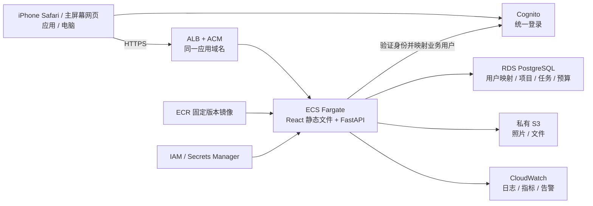

# AWS 统一部署方案

更新：2026-09-15。状态：**目标架构已确定，基础设施与代码待实施**。最新约束：小企业首次内部试用、iPhone 为主、后续业务逐步采用标准 AWS 服务；2026-09-18 demo，09-21 至 09-25 AWS 内部上线。

## 1. 本轮确定的架构

**ECS/Fargate + RDS PostgreSQL + 私有 S3；Cognito 统一身份，ECR/IAM/Secrets Manager/CloudWatch 作为配套基础。**

首期一个应用服务：现有 React 构建产物仍由 FastAPI 提供，网页和 API 同域名。先控制资源和应用数量，长期沿用相同的身份、数据库、文件、部署和审计体系。

这是项目的工程选择：长期采用标准 AWS 服务，初期保持应用整体部署。首次试用规模小，不等于每一层都要重新换一套临时产品。Lightsail 已不作为当前默认，避免后续迁移计算、数据库和权限体系；Amplify 留作前端独立发布时的选项。

## 2. 首期服务职责与规模

| 服务 | 首期职责 | 扩展路径 |
|---|---|---|
| ECS/Fargate | 一个 FastAPI/React 应用服务，起步小规格、最低一个 task；镜像固定版本 | 按负载增加 task，之后才按业务需要拆服务 |
| ALB + ACM | HTTPS 和健康检查；前端与 /api 同源 | 同一入口下增加路由或服务；自定义域名 DNS 按公司现有管理方式接入 |
| RDS PostgreSQL | 用户映射、项目、任务、文件元数据、预算等；私有连接、加密和备份 | 先评估小规格 Single-AZ，持续可用需求明确后启用 Multi-AZ/其他容量选项 |
| 私有 S3 | 附件、照片和后续可追溯资料；对象按环境/项目组织 | 生命周期、版本恢复、异步提取等按实际需求增加 |
| Cognito User Pool | AWS 正式环境的账号认证；管理员建立首批内部用户，关闭开放自助注册 | 统一其他业务的身份提供方；按应用配置 client，后续评估公司身份联邦 |
| ECR | 版本化应用镜像 | 镜像构建与扫描/发布策略逐步完善 |
| IAM + Secrets Manager | 服务角色、数据库等密钥；按环境和资源限制权限 | 轮转与审计按规模完善 |
| CloudWatch | 应用日志、错误/健康/资源告警，保留期明确 | 后续统一业务观测和成本归属 |
| AWS CDK（TypeScript） | 用一套基础设施代码描述网络、应用和持久化资源；环境参数化 | dev/staging/production 复用模块，避免控制台手动漂移 |

初期最低一个应用 task 与 RDS Single-AZ 不能承诺多可用区持续可用；允许维护窗口是内部试点的规模假设。数据库备份不是高可用替代。上线前验证恢复并记录可接受的维护/恢复目标。

成本核算包括 Fargate、ALB、RDS、存储/备份、公网地址、网络出口、日志和身份服务；按 region 与真实配置计算，不使用免费层或理想化小流量代替预算。网络设计明确选择 NAT 或必要端点/其他受控出口，避免 CDK 默认网络引入未评估的固定费用。

AWS 官方提供使用 CDK 创建 ALB/Fargate 服务的示例；RDS 支持 PostgreSQL 及不同可用性配置。[ECS 与 CDK](https://docs.aws.amazon.com/AmazonECS/latest/developerguide/tutorial-ecs-web-server-cdk.html)、[RDS](https://docs.aws.amazon.com/AmazonRDS/latest/UserGuide/Welcome.html)

## 3. 统一身份与业务权限

- 应用内部使用稳定 user_id 分派任务和记录历史；认证身份按 issuer + subject（Cognito 的 sub）映射，不能用邮箱或角色代号充当永久用户主键。
- Cognito 负责证明登录人身份；应用数据库仍管理角色、项目成员、审批资格与停用状态。Cognito 登录成功不等于能看全部项目或金额。
- 09-18 demo 优先复用已取得的本地独立账号实现，经认证适配层暴露相同业务用户。AWS 已准备好时可提前验证 Cognito；否则标清 demo 身份提供方，不声称已经接入 Cognito。
- 下周 AWS 正式试用接入 Cognito，停用客户端自报角色和演示认证。映射首批人员到已有业务 user_id，保留分派和活动历史；本地演示账号凭证不直接作为正式凭证迁入。
- 后端验证签名、issuer、有效期、token 用途、应用 client 及适用 scope；业务操作继续核验当前用户是否停用及其项目权限。
- 统一同源会话方案，登录回调地址、退出地址、Cookie/CSRF 控制在 Safari 和主屏幕窗口均要验证；不把令牌存入可公开缓存的数据。

Cognito 的身份 token 包含 sub，后端必须验证收到的 token；具体库和实现按官方文档核对。[身份声明](https://docs.aws.amazon.com/cognito/latest/developerguide/amazon-cognito-user-pools-using-the-id-token.html)、[JWT 验证](https://docs.aws.amazon.com/cognito/latest/developerguide/amazon-cognito-user-pools-using-tokens-verifying-a-jwt.html)

## 4. 应用和部署代码的边界

1. 保留 React/Cloudscape + FastAPI/SQLAlchemy 与 Docker，不为选云服务重写业务。增加环境配置、PostgreSQL 驱动和可重复迁移，正式库禁止自动 seed。
2. S3 存储适配：数据库保存对象 key；任务/文件读写继续通过应用授权；记录上传失败与元数据/对象不一致的恢复方式。
3. RDS 放在私有数据库子网，安全组限制到应用服务；Fargate task role 访问所需 S3 和服务，数据库密钥由 Secrets Manager 注入，凭证不入镜像/前端/Git。
4. ALB 到 task、task 到数据库、访问镜像/密钥/外部 API 的网络路径都通过实际验证；不能只验证容器启动。
5. infra/ 中维护 CDK、环境参数与输出；部署环境只读指定镜像版本，数据库迁移是明确的发布步骤。dev/demo/正式资源和数据隔离。
6. 基础 CI/CD 建立构建 → 必要测试 → 固定版本镜像 → 部署 → 健康验证；AWS 身份使用适当的短期角色授权。能回退应用，也明确数据库迁移兼容范围。
7. 公开 HTTPS + 登录访问是本轮内部使用入口。若要求网络仅内网/VPN可达，再落实私有入口；不能将账号限制称为网络隔离。

S3 支持限定期限的预签名 URL，需要先经过业务授权；URL 本身是访问凭证，不进入公开页面或日志。[S3 官方说明](https://docs.aws.amazon.com/AmazonS3/latest/userguide/using-presigned-url.html)

## 5. 上线与恢复条件

- 09-21 至 09-23：RDS/S3/Cognito 适配、CDK 环境、HTTPS、日志、网络、版本发布/回退与会话联调。
- 09-24 至 09-25：录入 2–3 套真实在建房，独立账号与项目授权，iPhone 执行和负责人验收。
- 测试换 task 和重新部署后项目/文件仍可用；从备份恢复到新数据库，并验证一条带附件的完整任务。
- 数据库自动备份、发布前快照、S3 版本/生命周期策略需实际配置；恢复目标和结果记入运维手册，不仅勾选“备份已开”。
- AWS 账号、权限、region、公司域名、预算、首批名单是上线输入；缺少输入时继续本地/合成资料验证，正式上线状态保持未完成。

RDS 提供自动备份与快照；具体保留和恢复能力需要配置与实测。[RDS 备份](https://docs.aws.amazon.com/AmazonRDS/latest/UserGuide/USER_WorkingWithAutomatedBackups.html)

## 6. 今后如何统一扩展

| 新需求 | 沿用的基础 | 到时再增加 |
|---|---|---|
| 多个内部业务应用 | Cognito 身份提供方、IAM、CDK、ECR、日志和发布约定 | 各业务 app client、权限与数据边界；不强制共享一张业务数据库 |
| 前端独立发布 | 相同业务 API 和身份边界 | Amplify Hosting；切分时重新验证回调、CORS 和会话 |
| 文件提取/异步处理 | S3 对象和项目/任务标识 | 按需求选择队列、事件或后台执行服务 |
| AI 助手 | 已授权的业务工具、来源与确认动作 | 模型提供方适配；采用 AWS 不自动改变既有模型产品方向 |
| 外部 SaaS | 项目权限、模板、审计与环境配置 | 组织/租户隔离、邀请、收费、租户级测试与运维；未完成前不宣称支持多租户 |
| 更高可用/并发 | ECS 服务、RDS、ALB、S3 | 多 task、Multi-AZ、扩容和性能观测 |

不预建所有未来服务；统一的是身份、接口、数据归属、部署与权限规则。首期仍是一个可交付的应用。

App Runner 已不向新客户开放，不作为新 AWS 账号的默认选择。ECS Express Mode 可用于评估和原型，但当前部署资产以可复现的 CDK 配置为准，不并行维护两套互不一致的云配置。[App Runner 说明](https://docs.aws.amazon.com/apprunner/latest/dg/apprunner-availability-change.html)、[ECS Express Mode](https://docs.aws.amazon.com/AmazonECS/latest/developerguide/express-service-overview.html)

Amplify 可以托管 React，待前端独立发布时接入即可。[AWS Amplify](https://aws.amazon.com/amplify/getting-started/)
