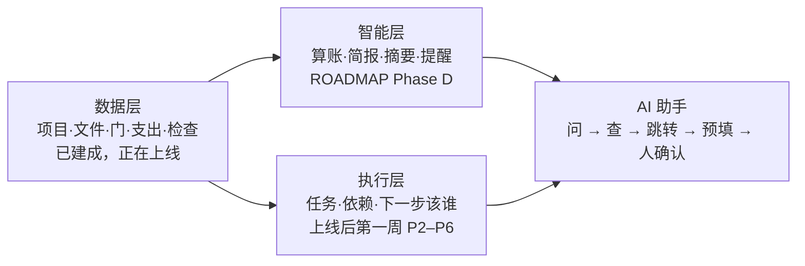
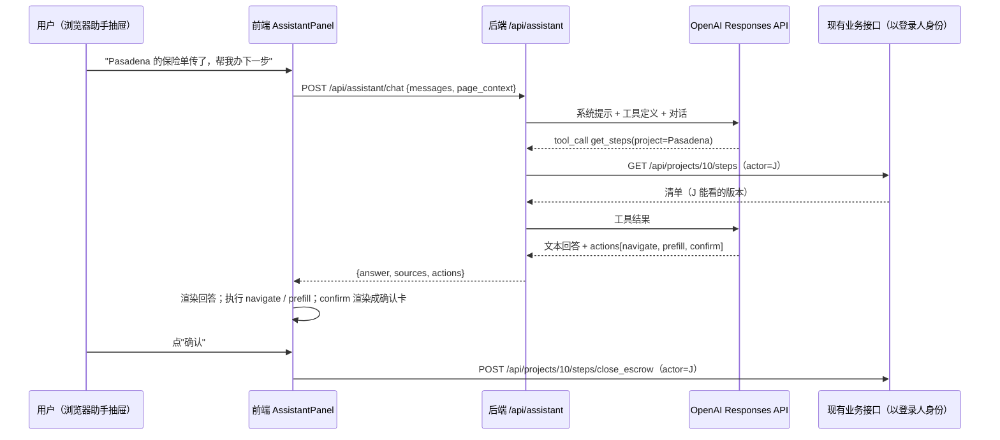

# 翻新项目平台 · 项目全景：现状逻辑、计划、未来视野（含 AI 助手接 agent 的设想）

> 写给两类读者。**第一部分**是大白话，给团队和老板，讲清楚系统是什么、规矩怎么定的、接下来做什么、以后能变成什么。**第二部分**是技术附录，给开发、Cursor 和其他 agent，讲接口、权限、数据结构和 AI 助手的可行架构。
> 日期：2026-09-14 晚。代码状态：提交 `7ffb139`，已部署到演示站 https://flip-house-platform.onrender.com 。
> 和 `ROADMAP.md` 的关系：ROADMAP 是给 agent 的施工地图；本文是给人看的全景，AI 助手部分是 ROADMAP 里没写的新内容。

---

# 第一部分 · 大白话

## 1. 这是什么

一个给翻房公司内部用的网页系统。一套房子从"看中"到"卖掉"要经过六段，每段有该交的东西（文件、照片、数字、记录）和该点头的人。系统把这些放在一处：**谁该做什么一目了然，做没做有凭证，钱只给该看的人看。**

它替代的是现在散在微信、Lark、Excel 和各人脑子里的进度。它不替代 Lark 聊天，不替代会计，不替代 MLS。

用的人：老板、D、J（决策）；负责人、L、PM（统筹）；K、Z、S、W、A、设计师（执行）；园丁、承包商（外部）。

## 2. 现在已经能做什么

| 功能 | 一句话 |
|---|---|
| 六段流程 | ① 预买房 → ② 买房与过户 → ③ 装修 → ④ 预上市 → ⑤ 卖房上市 → ⑥ 售出收尾。每段是一张步卡，点开看本段每一项谁负责、交了没 |
| 大节点要 D 和 J 各点一次 | Open escrow、Close escrow、可以开工、final 验收、收到 offer、交割完成，六道门。负责人可以代点，系统会记"代勾" |
| 交付物自动打勾 | 传了保险单，"买保险"自动完成；传了施工照片，"施工进度"自动完成；填了买入价，"定价"自动完成。手工勾要留名 |
| 按身份的工作台 | 老板看全公司资金和利润；负责人看谁卡住了；K 只看自己要办的水电和文件；园丁只看剪草。22 个小组件按身份组合，可拖拽 |
| 我的待办 | 每个人打开就是"现在轮到我的事"，一键跳到该传文件、该填数的地方 |
| 文件与照片 | 挂在具体步骤上，有到期日（保险、permit），执行角色下载不了合同和金额类文件 |
| 水电瓦斯、检查、采购 | K 填三家账户；Z 记 City 检查结果，final 没过就不能过门；J 管 37 项材料按节点采购 |
| 算账 | 买前交易分析器（买入、持有、装修、卖出，多版本，按目标利润率反推最高出价），"应用到项目"变成预算；买后记支出、看超没超 |
| 登录与账号 | 一人一号，号绑角色。管理员建账号、改角色、重置密码、停用。演示站不用登录，正式站必须登录 |
| 助手抽屉 | 右侧问一句"今天该关注什么"，按规则从项目数据里答，给"去看看"链接。**现在不是大模型**，见第 5 节 |

## 3. 系统里的规矩是怎么定的

这些是过去两周和团队反复对过的，写在代码里，改之前要先讨论。

**六段与门。** 每段里的事有先后，但不强制顺序；**门**才是硬约束。门由 D 和 J 各确认一次才算过，当前段就是"第一道没过的门所在的段"。所以不能手工把项目拖到下一段，只能把该交的交了、该点的点了。例外：final 验收那道门，Z 记的最后一次 City 检查必须是"通过"，否则 D、J 想点也点不了。

**四级颜色，钱只给两级看。**
- 紫 · 决策（老板、D、J）：看全部，包括买入价、预算、利润。
- 蓝 · 统筹（负责人、L、PM）：看全部钱，管流程，负责人还能建账号、代 D/J 确认。
- 青 · 执行（K、Z、S、W、A、设计师）：**看不到任何金额**，只看自己负责的项，只能传自己该传的文件。
- 灰 · 外部（园丁、承包商）：只看自己那一项。

这条规矩在后端执行，不是前端藏一下。青、灰身份请求项目时，接口返回的金额字段就是空。

**证据驱动。** 每一项写明"交付物是什么"：文件、照片、填一个数、记一条记录、或点确认。系统看到证据就自动打勾，谁交的、什么时候交的都记在"更新记录"里。紫、蓝身份可以在没证据的情况下手工勾，但会标成"手工确认，无证据"，给以后审计留痕。

**水电瓦斯的密码。** 允许存，但只回给紫、蓝和 K。其他人打开同一页，密码那格是空的。

**登录。** 账号密码自建，密码加盐存，会话是浏览器里一个签了名的 cookie，两周有效。演示模式（本地和 Render 演示站）不登录也能用顶栏"我是谁"自报身份，方便演示；正式模式下这个自报一律不认，必须登录。管理员登录后在演示模式里还能临时切身份，看别人看到的样子。

**不做的事。** 界面不做进度条、步骤条、轨道图（否决过三次）；客户的录音稿、采购表、流程图原件不进代码库；界面只用 Cloudscape 组件。

## 4. 接下来的计划

**这四天（9/15–9/18）：上公司内部 AWS，小范围用起来。**

| 天 | 做什么 | 状态 |
|---|---|---|
| D1 登录与配置 | 账号密码登录、用户管理、所有部署配置改环境变量、水电密码分级 | **已完成，已部署** |
| D2 云数据库与存储 | 数据库换 Postgres，文件换 S3，本地先跑通同一套验证 | 明天 |
| D3 AWS 搭建 | RDS + S3 + App Runner + 日志告警；建首批账号 | **卡在 AWS 账号还没开**，开户单在 ROADMAP 第 10 节 |
| D4 试运行 | 把 2–3 套在建房手工录进去，负责人用自己账号走一遍，写运维手册 | |

**上线后第一周：工作流引擎。** 现在的清单是"模板"，每套房都长一样。要变成"实例"：每套房能加减任务、改负责人、定到期日、标"不适用"，任务之间有依赖和阻塞，系统能算"下一步该谁"。这是 ROADMAP 里的 P2–P6，也是 AI 助手能干活的前提。

**再往后，按到齐顺序插入：** Lark 导入（等权限）、真实房产数据源（等预算，候选见 `docs/候选API方案.docx`）、已售项目的估算 vs 实际回灌到分析器。

## 5. 未来视野：AI 助手从"会答"到"会办"

### 5.1 三层的位置



AI 助手不是第四层，它是站在数据层和执行层之上的"入口"。没有干净的数据和明确的任务，助手无事可办。这也是为什么先上线、先补工作流引擎，再接大模型。

### 5.2 设想是什么样

用一个真实场景说。

> J 在助手里说：**"Pasadena 的保险单我传了，帮我把下一步办了。"**
>
> 助手做的事：
> 1. 查 Pasadena 这套房的六段清单，确认"开始贷款、买保险"已经因为保险单自动打勾。
> 2. 看当前段还有什么没完成：房屋检查报告（J 负责）、量尺（L 负责）、Close escrow 的门（D、J 各一勾）。
> 3. 回答："保险单已到，'开始贷款、买保险'已完成。你这段还差一份房屋检查报告；L 的量尺还没交；过户那道门 D 已经确认，等你。"
> 4. 页面自动跳到 Pasadena 的总览，展开第 ② 段，把"房屋检查"那一行的上传窗口打开，文件类型已经选好"检查报告"。
> 5. J 拖文件进去，点上传。助手接着问："过户门现在要我替你确认吗？"J 点"确认"，门过了，更新记录里写"J（助手代填）确认 Close escrow"。

三件事：**查**（不用 J 翻页面）、**跳**（页面自己到位、表单自己填好）、**办**（写操作先给人看一眼再执行）。

更多例子：
- 老板："这个月哪套超预算最多，为什么？" → 助手查预算汇总和支出，答一段话，每个数字后面带"来源：预算页 / 某笔支出"。
- K："我今天要办哪几家水电？" → 只列 K 的，跳到水电账户页，把公司名预填成上次用过的。
- 负责人："帮我把 NW Fisk 的采购表按已到货更新：马桶和瓷砖到了。" → 助手列出这两行的变更，负责人点"应用"。
- 新建："帮我按 5601 N Holmes 建一套房" → 跳到新建向导，地址已填、房产数据已查回来，J 只用选策略。

### 5.3 三条铁律（和 CLAUDE.md 一致）

1. **不发明数字。** 金额、估值、日期、进度只能来自我们的接口，大模型只负责理解意图、调工具、组织语言。答不出就说"系统里没有"，不猜。
2. **权限跟着登录人走。** 助手以谁的身份对话，就只能看到谁能看的东西。K 问"这套房买价多少"，助手拿到的就是空，答"你的身份看不到金额"。
3. **写操作先看再办。** 所有改数据的动作（打勾、确认门、改采购、填账户）先在界面上出一张"待确认"卡，人点了才执行，执行记在更新记录里并标注"助手代填"。

### 5.4 分几步走

| 阶段 | 能做什么 | 前提 | 大概时间 |
|---|---|---|---|
| 0 · 现在 | 规则助手：按关键词从项目数据里挑洞察，给链接 | 无 | 已有 |
| 1 · 只读问答 + 跳转 | 接大模型，能问任何问题，答案带来源；能把页面带到对的地方；按身份过滤 | 上线稳定；OpenAI 账号与费用批准；金额是否可出境定下来 | 上线后 2–3 周 |
| 2 · 预填 + 确认执行 | 上传窗口、编辑窗口、新建向导自动填好；写操作走确认卡 | 工作流引擎 P2–P4 做完（有任务实例才有"下一步") | 之后 3–4 周 |
| 3 · 主动 | 每天早上给负责人 / 老板一段摘要；到期、阻塞主动提醒（Lark） | 有真房子数据跑过一个完整周期；Lark 机器人权限 | ROADMAP Phase D |

每一步都能单独停下来用，不做到最后也不浪费。

### 5.5 用 OpenAI 的整套方案，怎么接

设想是全用 OpenAI：模型 + 函数调用 + Agents SDK。接法是**后端持钥匙，前端只传话**：浏览器里的助手抽屉把问题发给我们自己的后端，后端带上"这是谁在问"去调 OpenAI，OpenAI 决定要调我们哪几个接口，后端替它调（用问话人的身份），把结果再交给模型组织回答。OpenAI 的 key 永远不出后端；模型永远不直接碰数据库。

不用 OpenAI 的"电脑操作"（Computer Use）方案。我们有自己的接口，让模型模拟点鼠标既慢又不可靠，还绕过权限。

## 6. 现在就要定的事与风险

| 事 | 谁定 | 为什么现在 |
|---|---|---|
| AWS 账号（开户单见 ROADMAP §10） | 用户 | D3 建不了资源 |
| 首批账号名单与角色代号对应（George、Tiffany 是谁） | 负责人 | D3 建账号 |
| 金额和业主信息能不能送到 OpenAI | 老板 | 决定阶段 1 能答什么。不能就只答不含金额的问题，或走 Azure OpenAI 的私有部署 |
| OpenAI 月费上限 | 老板 | 估算：每次对话 3–6 次工具调用，约 1–3 万 token；十个人每天各问十次，月费约 100–300 美元级别（按当前定价粗估，要以实际为准） |
| 门的位置、第二 lender、付款节点等 8 个流程问题 | 团队 | 见 ROADMAP §8，影响工作流引擎的建模 |

风险：AWS 网络（App Runner 连 RDS）最容易卡，D3 上午先做；大模型答错的代价在"办"比在"答"高十倍，所以阶段 2 之前所有写操作都必须过确认卡；真实数据源没预算之前，"AI 属性简报"只能用模拟数据演示。

---

# 第二部分 · 技术附录

## A. 模块与文件地图

```
backend/app/
  settings.py        环境变量集中读取（DB_URL、DEMO_MODE、SEED_DEMO、SECRET_KEY、STORAGE、S3_BUCKET、CORS_ORIGINS、ADMIN_USER/PASSWORD）
  db.py              engine / Session / init_db（create_all + 旧库补列）
  models.py          15 张表 + users
  dictionaries.py    ROLES、TIERS、PERMISSIONS、STAGE_CHECKLIST（六段 31 项）、FILE_TYPES、DASHBOARD_LAYOUTS、WIDGET_ACCESS、meta()
  steps.py           compute_steps（证据 → 打勾 → 门 → 当前段）、derive_legacy_stage / sync_legacy_stage
  auth.py            密码哈希、cookie 签名、current_user、ensure_admin
  status.py          项目健康状态（超支、落后）
  analysis.py        交易分析器（amortize、full_outputs）；prefill_for_project 在 routers/analyses.py
  seed.py            十套示例房
  routers/
    common.py        get_actor、allowed/require、can_read_money、log_update、project_out（金额打码）
    auth.py          /api/auth/*、/api/users
    projects.py      项目 CRUD
    steps.py         清单打勾 / 门确认 / 更新记录
    files.py         文件（step_key、expires_at、按身份限下载）
    budget.py        预算项 / 支出 / 汇总（require budget）
    analyses.py      交易分析（require analysis）
    ops.py           水电瓦斯（utility_secret 打码）、检查记录
    procurement.py   采购行
    property_data.py 房产字段多来源
    dashboard.py     summary / widgets / role（按身份出块）
    lookup.py、meta.py
frontend/src/
  App.tsx            会话状态（me / demoMode / override）、顶栏身份菜单、侧栏、路由
  lib/actor.ts       ActorContext；lib/role.ts useRole()（tier、color、can）
  lib/stepActions.ts actionHref / actionMode / canActOn / canConfirm（深链与动作的唯一来源）
  lib/insights.ts    规则助手的洞察计算（12 类标签，ROLE_TAGS 按身份过滤）
  api/client.ts      所有接口封装；401 时广播 auth:401
  pages/             Dashboard、MyTodo、AddProject、Login、Users、project/*（ProjectPage 五页签）
  components/        StepsPanel（六张步卡 + 本步面板）、MyTodoTable、UploadForm、UtilitiesPanel、InspectionsPanel、AssistantPanel、OwnerTag …
```

## B. 权限与身份的真实规则

`get_actor(request, db, x_actor)`（`routers/common.py`）返回角色代号，判定顺序：
1. cookie `session` 有效 → 用户的 `role_code`；若 `DEMO_MODE=1` 且用户是管理员且带了 `X-Actor` 头 → 用头里的代号（演示切身份）。
2. 没 cookie：`DEMO_MODE=1` → `X-Actor`（默认负责人）；`DEMO_MODE=0` → 401。

`PERMISSIONS`（`dictionaries.py`）：值是允许的级别或代号列表，`allowed(actor, action)` 看 `tier_of(actor)` 或代号是否在列表里。

| action | 允许 |
|---|---|
| read_money、create_project、edit_project、edit_money、budget、analysis、upload_any、tick_any、manage_users | purple、blue |
| delete_project | purple、负责人 |
| confirm_for_others（代 D/J 过门） | 负责人 |
| procurement | purple、blue、J |
| utilities、utility_secret（看水电密码） | purple、blue、K |
| inspections | purple、blue、Z |
| dashboard | 四级都可，块由 `DASHBOARD_LAYOUTS` / `WIDGET_ACCESS` 决定 |

打码点：`project_out` 把 purchase_price / target_arv / sale_price / budget_* 置空并标 `money_hidden`；`steps._evidence` 与 `routers/steps._with_names` 把提示里的金额抹掉；`files._out` 金额置空、`_can_download` 拦 MONEY_DOCS；`ops.list_utilities` 非 utility_secret 身份 password 置空；dashboard 三个接口按身份返回无钱版本。

用户表 `users(username 唯一, display_name, role_code, is_admin, password_hash, active, last_login_at)`；`/api/users` 只有 `is_admin` 能进，不能停用或降级自己。

## C. 六段清单的数据结构与证据规则

`STAGE_CHECKLIST = [{key, label, short, desc, items:[...]}]`，每项：

```python
{"key": "insurance", "title": "开始贷款、买保险", "ws": "交易", "owners": ["J", "K"],
 "evidence": "file:insurance", "deliverable": _f("保险单（填到期日）", "insurance"),
 "gate": False, "confirm": []}
```

evidence 语法（`steps._evidence`）：`field:<列名>`、`file:<类型>`、`photo:<step_key>`、`analysis:any`、`expense:any`、`procurement:critical`（before_rough 波次全部 received / na）、`utilities:on|off`、`inspections:any|final`、`confirm`（门：需要 `confirm` 列表里每人各勾一次，存成 `project_steps` 的 `key:D`、`key:J`）、`manual`。`a|b` 表示任一满足。

当前段 = 第一段"有门没过"的段；全部门过且没有更早未完成项 → `done`。手工勾证据项 → `how="manual_override"`，只允许 tick_any。`derive_legacy_stage` 把六段映射回 `projects.stage/substage`（旧字段仍被工作台和筛选用）。

六段 31 项、六道 D+J 门 + 一道证据门（上市：填 list_date 或传 listing_agreement）。清单全文见 `dictionaries.py`，勿在文档里复制。

## D. AI 助手可行架构

### D.1 总图



要点：OpenAI key 只在后端 `settings.py` 读（`OPENAI_API_KEY`、`ASSISTANT_MODEL`）；后端替模型调接口时用的是 `get_actor` 解析出的当前登录人，所以权限、打码、留痕全部复用，一行不用改。

### D.2 工具面

把现有接口包成模型可调的函数，分两类。

只读（模型可以直接调，结果直接进上下文）：
`list_projects(q, stage)`、`get_project(id)`、`get_steps(id)`、`get_files(id)`、`get_utilities(id)`、`get_inspections(id)`、`get_procurement(id)`、`get_budget_summary(id)`（require budget，青灰自然 403 → 工具返回"无权限"）、`get_my_dashboard()`（`/api/dashboard/role`）、`get_updates(id)`、`get_meta()`、`lookup_address(q)`。

写（模型**不能**直接执行，只能产出 `confirm` 动作，前端确认后由前端调接口）：
`tick_step(id, key, note)`、`confirm_gate(id, key)`、`save_utility(id, kind, body)`、`add_inspection(id, body)`、`patch_procurement(item_id, status, note)`、`patch_file(file_id, body)`、`patch_project(id, dates/risks/notes)`。

文件上传永远由人做（模型拿不到本地文件），助手只负责把上传窗口打开并选好类型。

### D.3 UI 动作协议

后端返回给前端的 `actions` 数组，前端逐条执行：

```json
[
  {"type": "navigate", "href": "/projects/10?tab=overview&step=home_inspection&action=upload"},
  {"type": "prefill", "form": "upload", "values": {"doc_type": "inspection", "step_key": "home_inspection"}},
  {"type": "confirm", "tool": "confirm_gate", "args": {"project_id": 10, "key": "close_escrow"},
   "summary": "以 J 的身份确认 Pasadena 的 Close escrow 门", "risk": "gate"}
]
```

- `navigate.href` 由后端用与 `lib/stepActions.ts::actionHref` 同样的规则生成（建议把这套规则搬一份到后端 `steps.py`，或让前端根据 `{project_id, step_key, mode}` 自己算，避免两处漂移）。
- `prefill.form` 先支持三个已有入口：`upload`（`UploadForm` 已有 `docType / stepKey / lockType` props）、`add_project`（`AddProject` 已认 `?address=`）、`edit_project`（`EditProjectModal` 需要加 `initial` props）。
- `confirm` 渲染成 Cloudscape 的确认卡（summary + 参数表 + "执行 / 取消"），执行后 `log_update` 的 actor 写成 `J（助手代填）`。
- 每条回答带 `sources: [{tool, args, summary}]`，前端折叠显示"依据"。

### D.4 OpenAI 方案的具体用法

- **Responses API + function calling**：单轮"问 → 调工具 → 答"。工具定义用 JSON Schema，从 FastAPI 的 OpenAPI 文档半自动生成（`/openapi.json` 已有）。
- **Structured Outputs**：把最终回复约束成 `{answer, sources, actions}` 的 schema，杜绝动作 JSON 格式错。
- **Agents SDK**：阶段 2 多步任务（"把三项都办了"）用它管理循环、工具重试、最大步数；阶段 1 不需要。
- **不用**：Computer Use（有接口不模拟点击）、文件检索 / 向量库（项目数据是结构化的，直接查接口比检索准）、让模型算钱（分析器是确定性代码，模型只解释结果）。
- **模型选择**：先用中等价位模型跑阶段 1，工具调用准确率够；简报类长文再考虑高一档。
- **合规**：金额与业主信息是否可送到 OpenAI 由老板定；不行则两条路：工具结果里先打码再喂模型（青灰版本的接口已经是打码的，直接复用）；或走 Azure OpenAI 私有部署，接口一样。
- **成本**：系统提示 + 工具定义约 3k token，每次工具调用来回约 2–4k，一次对话 3–6 次调用，粗估 1–3 万 token；具体价格以当时定价为准。要在后端记每次对话的 token 数进一张 `assistant_logs` 表，第一周就能看真实费用。

### D.5 分期与前提

| 阶段 | 交付 | 前提 | 完成标志 |
|---|---|---|---|
| 1 只读 + 跳转 | `routers/assistant.py`（chat 接口、只读工具、来源）；`AssistantPanel` 改为调后端、渲染来源、执行 navigate；`assistant_logs` 表 | 上线稳定；`OPENAI_API_KEY`；出境决定 | 十个真实问题（每个身份至少一个）答案与页面一致，青灰身份对话里出现不了金额 |
| 2 预填 + 确认执行 | 写工具 + 确认卡；`EditProjectModal` 加 `initial`；`StepsPanel` 深链去重改为带时间戳；Agents SDK 管多步 | P2–P4（任务实例、依赖、下一步引擎） | 场景 5.2 全程跑通；更新记录里能看到"助手代填" |
| 3 主动 | 定时任务生成日报（`project_updates` + 阻塞 + 下一步）；Lark 推送 | 真数据跑过一个周期；Lark 机器人 | 负责人连续五天早上收到日报并认为有用 |

### D.6 接之前要先改的小事

1. `AssistantPanel.tsx` 调 `loadInsights(ps)` 没传 actor，青灰身份看到的洞察没过滤，先补上（一行）。
2. `StepsPanel.tsx` 深链用 `${step}:${action}` 去重，同一 URL 第二次不触发；改成加时间戳参数或在 navigate 时先清空。
3. `EditProjectModal.tsx` 加可选 `initial` props，与 `project` 合并后再进表单。
4. 后端加 `assistant_logs(user_id, question, tools_called, tokens, actions, created_at)`。
5. `settings.py` 加 `OPENAI_API_KEY`、`ASSISTANT_MODEL`、`ASSISTANT_ENABLED`；没配就保持规则助手，界面不变。

## E. 开放问题清单

流程类（原样引自 ROADMAP §8，未答）：门的位置与老板是否确认；第二 lender；签署 / 交割 / 售出以什么事件为准；3.7 是内部检查还是市政中期检查；装修付款节点与审批人；园林 / 承包商 / 清洁 / escrow / lender 收尾由谁做；承包商进不进系统；代号与真名对应。

上线类：AWS 账号与 region；首批账号名单；上线用空库（已定）；Render 演示站是否长期保留。

AI 助手类（本文新增）：
1. 金额与业主信息能否送到 OpenAI；不能的话接受"青灰版打码数据"还是走 Azure。
2. 月费上限与谁批。
3. 助手代填的写操作，是否要在更新记录里显著标出，老板要不要每周看一份"助手做了什么"。
4. 阶段 1 先给哪几个身份用（建议负责人 + J 先试两周）。
5. 对话记录保留多久，谁能看。
