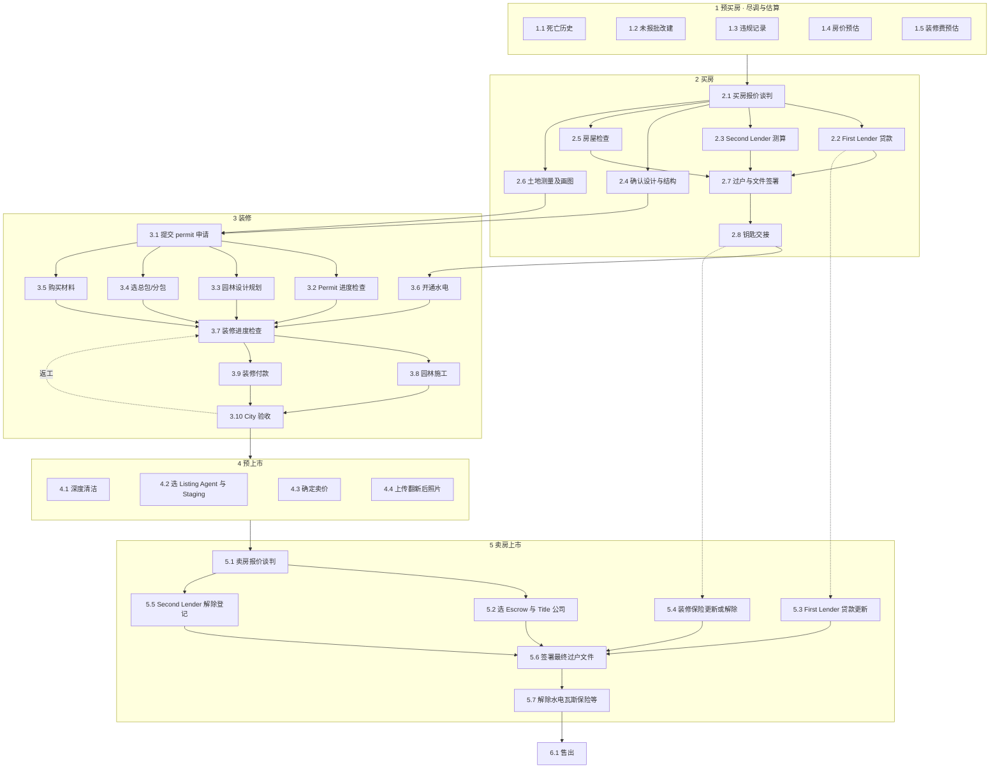

# 翻新项目：以团队定稿流程为准的系统性审计（v3，2026-09-14）

> 2026-09-15 状态说明：历史流程证据与开放问题，能力状态对应当时工作区。已确认业务事实可引用；旧排期、要求先问全部问题和部署计划不作为当前指令。 当前 AI 入口见 [AGENTS](../AGENTS.md)，交付顺序见 [ROADMAP](../ROADMAP.md)，产品原则见 [当前方向](产品方向与执行原则.md)。本文件保留原始历史内容。

> 给 Cursor / 后续开发用的上下文文档。
> 标记：**✅ 团队定稿**（`专业流程 完整版.jpg`，Sky Vision Development《All About Flipping》第 4 节）；**✅ 负责人确认**（原稿 24 条、9/14 录音、口头补充）；**🟡 我们推断**；**❓ 未知**。
> 代码事实以 2026-09-14 晚的工作区为准（未提交）。路径都是仓库相对路径。
> **2026-09-14 14:10 更正**：定稿是 **35 项**（5+8+10+4+7+1），系统现有 **29 项**（4+6+5+5+9），本文初版写的 33 / 27 是数错了。另一份独立审计 `docs/权威流程对照审计_2026-09-14.md` 指出的 P0/P1 问题已核实，见本文第 10 节。J 的采购表 `项目采购进度(1).xlsx` 已收到，见第 11 节。

---

## 0. 一页总结

1. **权威流程变了**：团队定稿是 **6 段 35 项**（预买房 → 买房 → 装修 → 预上市 → 卖房上市 → 售出），系统现在是负责人 24 条演化来的 **5 段 29 项**。两者主干一致，但定稿多出一整段**预买房尽调**、明确了**两个 lender**、**承包商选择与付款**、**园林**、**City 验收返工循环**、**预上市四件事**、**卖房侧 escrow/title 与贷款保险处理**。
2. **定稿图上没有角色、没有门**。负责人给的角色代号和"D+J 确认大节点"要映射到新流程上，映射是 🟡，需要确认（第 4 节）。
3. **预买房那一段就是 CLAUDE.md 的 AI 简报**（死亡记录、无证改建、违规记录、房价预估、装修费预估）。它在定稿里是流程第一段，说明客户把"尽调 + 估算"当成正式步骤，不是锦上添花。
4. **系统仍是"记录型"不是"约束型"**：没有任何先后关系在后端被强制。定稿里的依赖箭头（比如 permit 申请需要土地测量图 + 设计确认；City 验收不过回到进度检查）现在都没有落成规则。
5. 本文第 5 节给出**新旧逐项映射表**，第 7 节给出**改造清单**，第 8 节是 **24 个开放问题**（其中 8 个会改数据模型）。

---

## 1. 团队定稿流程（逐项转录）✅

编号沿用图上编号。"←" 表示图上的输入箭头。

### 1 · 预买房 Pre-Purchase（五项并行，全部汇入 2.1）
| # | 中 / 英 | 输出 |
|---|---|---|
| 1.1 | 房屋死亡历史 / Property Death History | 有无、来源 |
| 1.2 | 未报批改建 / Unpermitted Modifications | 有无、面积 |
| 1.3 | 建筑违规记录 / Building Violation Records | 有无、条目 |
| 1.4 | 房价预估 / Price Estimation | 估值区间 |
| 1.5 | 装修费用预估 / Renovation Cost Estimate | 预算区间 |

### 2 · 买房 Purchase
| # | 中 / 英 | ← 输入 | → 输出去向 |
|---|---|---|---|
| 2.1 | 买房报价谈判 / Purchase Price Negotiation | 1.1–1.5 | 2.2 2.3 2.4 2.5 2.6 |
| 2.2 | First Lender 银行贷款 / First Lender Bank Loan | 2.1 | 2.7；**5.3** |
| 2.3 | Second Lender 测算 / Second Lender Assessment | 2.1 | 2.7 |
| 2.4 | 确认室内设计和结构工程 / Confirm Interior Design & Structural Engineering | 2.1 | **3.1** |
| 2.5 | 房屋检查 / Home Inspection | 2.1 | 2.7 |
| 2.6 | 土地测量及画图 / Land Survey & Drawing | 2.1 | **3.1** |
| 2.7 | 完成过户与文件签署 / Complete Title Transfer & Document Signing | 2.2 2.3 2.5 | 2.8 |
| 2.8 | 钥匙交接 / Key Handover | 2.7 | **3.6**；**5.4** |

### 3 · 装修 Renovation
| # | 中 / 英 | ← 输入 | → 输出去向 |
|---|---|---|---|
| 3.1 | 提交建筑许可申请 / Submit Building Permit Application | 2.4 2.6 | 3.2 3.3 3.4 3.5 |
| 3.2 | Permit 进度检查 / Permit Progress Check | 3.1 | 3.7 |
| 3.3 | 园林设计和规划 / Landscape Design & Planning | 3.1 | 3.7 |
| 3.4 | 确定总包商或分包商 / Select Contractors & Subcontractors | 3.1 | 3.7 |
| 3.5 | 购买建筑材料 / Purchase Building Materials | 3.1 | 3.7 |
| 3.6 | 开通水电 / Set Up Utilities | 2.8 | 3.7 |
| 3.7 | 装修进度检查 / Renovation Progress Inspection | 3.2–3.6；**3.10 返工** | 3.8 3.9 |
| 3.8 | 园林施工 / Landscaping Construction | 3.7 | 3.10 |
| 3.9 | 装修付款 / Renovation Payment | 3.7 | 3.10 |
| 3.10 | City 验收 / City Inspection | 3.8 3.9 | 4.1–4.4；**不过 → 回 3.7** |

### 4 · 预上市 Pre-Listing（四项并行，全部汇入 5.1）
| # | 中 / 英 |
|---|---|
| 4.1 | 深度清洁 / Deep Cleaning |
| 4.2 | 选 Listing Agent 及 Staging / Select Listing Agent & Staging |
| 4.3 | 确定卖价 / Determine Selling Price |
| 4.4 | 上传翻新后照片 / Upload Renovated Photos |

### 5 · 卖房上市 Listing & Sale
| # | 中 / 英 | ← 输入 | → 输出去向 |
|---|---|---|---|
| 5.1 | 卖房报价谈判 / Sale Negotiation | 4.1–4.4 | 5.2 5.5 |
| 5.2 | 选择 Escrow 和 Title 公司 / Select Escrow & Title Company | 5.1 | 5.6 |
| 5.3 | First Lender Loan 更新 / First Lender Loan Renew | 2.2 | 5.6 |
| 5.4 | 装修保险更新或解除 / Renovation Insurance Renew | 2.8 | 5.6 |
| 5.5 | Second Lender 解除登记 / Second Lender Deregistration | 5.1 | 5.6 |
| 5.6 | 签署最终过户文件 / Sign Final Transfer Documents | 5.2 5.3 5.4 5.5 | 5.7 |
| 5.7 | 解除水电、瓦斯、钉子❓、保险等服务 / Cancel Utilities, Gas, Insurance, etc. | 5.6 | 6.1 |

（"钉子"原图如此，疑为某项订阅或安防服务 ❓Q17）

### 6 · 售出 Sold
| 6.1 | 售出 / Sold |

### 1.x 关键依赖（图上的箭头，✅）
- permit 申请 3.1 **需要** 土地测量图 2.6 **和** 设计/结构确认 2.4。
- 过户 2.7 **需要** 第一 lender 贷款 2.2、第二 lender 测算 2.3、房屋检查 2.5。
- 开通水电 3.6 在 钥匙交接 2.8 之后（与"水电在 close 时开"一致 ✅）。
- 装修进度检查 3.7 是装修段的汇聚点：permit 进度、园林设计、承包商、材料、水电全部汇入它；付款 3.9 和园林施工 3.8 由它触发。
- City 验收 3.10 不通过 → 回到 3.7（返工循环）。
- 卖房侧四件事（escrow/title、第一 lender 更新、保险更新、第二 lender 解除）汇入 签署过户 5.6。
- 第一 lender 贷款 2.2 → 5.3；钥匙交接 2.8（含保险）→ 5.4：买入时办的贷款和保险要在卖出时处理。

---

## 2. 流程总图（mermaid，按定稿）

---

## 3. 门（大节点）放在哪 🟡

定稿图没有门。负责人确认"每个大节点由 D + J 一起确认"（✅ 负责人）。把门放在定稿的汇聚点上，是我们的推断，要确认：

| 门 | 放在定稿的哪一步之后 | 过门条件（建议） | 对应现系统 |
|---|---|---|---|
| G1 谈成 / Open escrow | 2.1 买房报价谈判 | 买入价已填 + D、J 确认 | `open_escrow` |
| G2 房子到手 / Close | 2.8 钥匙交接（2.7 过户之后） | 2.2 2.3 2.5 完成 + 过户文件 + D、J 确认 | `close_escrow` |
| G3 可以开工 | 3.2 Permit 进度检查显示已核发 | permit 文件 + D、J 确认 | `start` |
| G4 施工结束 / final | 3.10 City 验收通过 | 最后一次验收 passed + D、J 确认 | `final` |
| G5 收到 offer | 5.1 卖房报价谈判 | offer 文件 + D、J 确认 | `offer` |
| G6 交割完成 | 5.6 签署最终过户文件 | 成交日期 + 结算单 + D、J 确认 | `closed` |
| G7 售出 | 6.1 | 5.7 全部解除 | （无；现为"全部完成"） |

定稿里 **1 预买房** 段没有门：从"看中一套房"到"谈判"之间是否要一道"决定出价"的门（董事会定价）❓Q2。

---

## 4. 角色映射到定稿 🟡（代号来自负责人，归属是推断）

| 定稿项 | 现系统对应 | 谁做（推断） | 依据 |
|---|---|---|---|
| 1.1 死亡历史、1.2 未报批改建 | `screen` 筛选房源 | J | 原稿"J 筛选房源：死亡记录 / unpermitted sqft" ✅ |
| 1.3 违规记录 | — | J 🟡 | 同类尽调 |
| 1.4 房价预估、1.5 装修费预估 | 交易分析器（`deal_analyses`） | L 估价（"量尺同时估价"✅）、D/L 董事会 | 录音 |
| 2.1 买房报价谈判 | `price` 董事会定价 | D、L | 原稿 ✅ |
| 2.2 First Lender 贷款 | `loan_insurance`、`loan_doc` | J、K 开始；D、L 签 | 原稿 ✅ |
| 2.3 Second Lender 测算 | — | ❓ | 原稿没有第二 lender |
| 2.4 确认设计与结构 | `design`、`design_final` | 设计师 | 原稿 ✅ |
| 2.5 房屋检查 | 文件类型 `inspection` 检验报告 | J 🟡（默认上传人） | — |
| 2.6 土地测量及画图 | `measure` 量尺 | L | 原稿"L 量尺" ✅，但"土地测量"可能是外包 surveyor ❓ |
| 2.7 过户与文件签署 | `close_escrow` 门 + 结算单 | D 签、K 结算单 | 原稿 ✅ |
| 2.8 钥匙交接 | — | 负责人 / L 🟡 | — |
| 3.1 提交 permit 申请 | `permit_apply` | Z | 原稿 ✅ |
| 3.2 Permit 进度检查 | `permit_issued`（只有终态） | Z | 原稿 ✅ |
| 3.3 园林设计规划 | — | A 🟡（原稿 A 只有剪草） | ❓ |
| 3.4 选总包/分包 | — | L+D（管施工）🟡 | 录音"施工 L+D 管" |
| 3.5 购买材料 | `purchase` 分阶段采购 | J | 录音 ✅ |
| 3.6 开通水电 | `utilities_on` | K | 原稿 ✅ |
| 3.7 装修进度检查 | `progress` 施工进度照片 + `inspections` 部分 | PM | 录音 ✅ |
| 3.8 园林施工 | — | A / 园丁 🟡 | — |
| 3.9 装修付款 | `expenses` 支出（没有付款节点概念） | J 🟡 / 负责人 | ❓ |
| 3.10 City 验收 | `inspections` 记录 + `final` 门 | Z | 原稿 ✅ |
| 4.1 深度清洁 | — | A 🟡 | — |
| 4.2 选 Listing Agent 及 Staging | `agent`、`staging` | J | 原稿 ✅ |
| 4.3 确定卖价 | `target_arv` 字段 / 分析器 | D、L 🟡 | — |
| 4.4 上传翻新后照片 | 文件 `photo` step=staging（近似） | J / PM 🟡 | — |
| 5.1 卖房报价谈判 | `offer` 门 | J（agent）、D | 原稿 ✅ |
| 5.2 选 Escrow 与 Title 公司 | — | S、W 🟡 | 原稿"S+W 卖房文件" |
| 5.3 First Lender 贷款更新 | — | K 🟡 | ❓ |
| 5.4 装修保险更新或解除 | `services_off` 的一半 | K | 原稿"K 取消保险" ✅ |
| 5.5 Second Lender 解除登记 | — | ❓ | — |
| 5.6 签署最终过户文件 | `sign`、`sale_docs`、`disclosure`、`closed` 门 | S、W 准备；K 披露；D 签 | 原稿 ✅ |
| 5.7 解除水电瓦斯保险等 | `services_off` | K | 原稿 ✅ |
| 6.1 售出 | "全部完成" | — | — |

---

## 5. 新旧逐项映射：系统有什么、缺什么、多什么

### 5.1 定稿有、系统没有（13 组）
| 定稿项 | 现在系统里最近的东西 | 差距 | 影响数据模型？ |
|---|---|---|---|
| 1.3 建筑违规记录 | 风险文本框 | 无结构化字段 | 是：尽调对象（1.1–1.3 三项 + 来源 + 日期） |
| 1.4 / 1.5 房价与装修费预估 | 交易分析器（行业默认值） | 没有作为流程步骤、没有 comps / AVM 数据源 | 是：估值记录 + 来源 |
| 2.3 Second Lender 测算 / 5.5 解除登记 | 无 | 没有"第二贷款"概念 | 是：贷款对象（lender、类型、金额、状态、登记 / 解除） |
| 2.5 房屋检查 | 文件类型"检验报告" | 不是清单项 | 否（加清单项 + 文件） |
| 2.8 钥匙交接 | 无 | — | 否（清单项 + 日期） |
| 3.2 Permit 进度检查 | 只有"拿到 permit 文件" | 缺申请中 / 补件 / 核发的中间状态 | 是：permit 对象（提交日、状态、备注、核发日） |
| 3.3 园林设计 / 3.8 园林施工 | 只有"园丁剪草" | 园林是一条独立线 | 否（两个清单项 + 照片） |
| 3.4 选总包 / 分包 | 无承包商对象 | 合同文件类型有，但没有承包商 | 是：承包商对象（名称、工种、合同、付款） |
| 3.9 装修付款 | 支出表 | 没有"付款节点 / 应付 / 已付" | 是：付款记录挂承包商 |
| 3.10 返工循环 | 检查记录有 failed | 没有"返工 → 复检"的链接 | 否（检查记录加 parent_id 即可） |
| 4.1 深度清洁 | 无 | — | 否 |
| 4.3 确定卖价 | `target_arv` | 不是清单项、无确认动作 | 否（清单项 + 填数） |
| 4.4 上传翻新后照片 | 照片挂 step | 没有专门的"成品照"分类 | 否（step_key=after_photos） |
| 5.2 选 Escrow/Title、5.3 贷款更新 | 无 | — | 否 / 依赖贷款对象 |

### 5.2 系统有、定稿没画（保留，但要问）
| 系统项 | 说明 | 处理 |
|---|---|---|
| 开始贷款、买保险（J、K） | 定稿 2.2 只画贷款；保险出现在 2.8 → 5.4 的暗线 | 保留，挂到 2.2 / 2.8 |
| 先干不用 permit 的活（PM） | 定稿没有 | 保留为 3.x 可选项 ❓Q6 |
| agent 介入（J） | 定稿 4.2 "选 Listing Agent" | 合并到 4.2 |
| 剪草（A、园丁） | 定稿 3.8 园林施工 | 合并到园林线 |
| seller disclosure（K） | 定稿 5.6 里 | 保留为 5.6 的子文件 |
| D+J 双勾大节点 | 定稿无门 | 保留（负责人确认 ✅），位置见第 3 节 |

### 5.3 段的划分不同
- 定稿把"设计定稿 + permit"并进**装修段**（3.1），把"设计与结构确认"放在**买房段**（2.4）。我们的③"设计定稿 + permit"要拆：设计确认回到买房段，permit 申请归装修段。
- 定稿把 **预上市** 单独成段（清洁、agent/staging、定价、照片），我们把它混在⑤。
- 定稿有 **售出** 作为终态段。

---

## 6. 现系统模块盘点（审计事实）

### 6.1 接口（41 个）与权限
- 有权限检查：项目增删改、勾选 / 确认、文件增删改、预算 / 分析 / 工作台三个路由整体挂 `_guard`、水电写、检查写。
- **没有权限检查的写接口**：`PATCH /api/projects/{id}/property`、`POST .../property/fields/{field}/primary`（任何身份可改房产字段）。
- **文件下载无身份检查**：`GET /api/files/{id}/download`。
- 青灰读项目时钱字段抹成 null（`money_hidden`），不是 403。

### 6.2 表（14 张）
`properties` `property_field_sources` `owners` `mortgages` `sales_history` `projects` `budget_lines` `expenses` `files` `deal_analyses` `project_updates` `project_steps` `utility_accounts` `inspections`。
没有：人 / 账号、承包商、贷款（自己的）、permit、尽调、付款、通知、任务模板。

### 6.3 规则引擎（`backend/app/steps.py`）
- 证据规则：`project:exists` `field:` `file:` `photo:` `expense:any` `utilities:on|off` `inspections:any|final` `confirm` `manual`。
- 门 = `confirm` 项，`project_steps` 存 `key:D` / `key:J`，双勾才过。
- 当前阶段 = 第一道没过的门所在的段；门后事项进 `earlier_undone`。
- **不做任何先后校验**：`toggle_step` 只查权限，任何步骤任何时候可勾；`PATCH /projects` 不校验阶段转换；前端只对"还没到"的段隐藏按钮。

### 6.4 两套阶段模型并存
`projects.stage/substage`（lead / active / portfolio + 子阶段）驱动状态规则、阶段分布、线索漏斗、编辑弹窗；五段清单 `current_stage` 驱动总览 B、工作台 N、我的待办。两者不同步。

### 6.5 前端块（评审字母）
工作台 A–N；项目页头 A + 工作流卡 B–D；总览 A–I（B = 五张步卡 + 本步面板，I = 检查记录）；分析 A–I；数据 A–E（E = 水电瓦斯）；文件 A–B；预算 A–E（E = 采购清单占位）；新建向导 A–H；我的待办 A。

### 6.6 提醒规则（`frontend/src/lib/insights.ts`）
超支、落后、临近完工、等 permit、保险到期、检查没过、水电卡住、未算账、待定价、轮到、缺数据。`缺文件` 定义了但从不触发。`保险到期` 对任何带到期日的文件触发。

---

## 7. 审计发现与改造清单

### A. 已实现且验证过
J 建项目 → L 交照片自动勾 → D 填价 → D、J 双勾过门 → K 只见待办、无钱、无分析预算页签；越权 403；文件挂步骤、照片自动打勾；保险到期提醒。

### B. 要按定稿重排的（下一轮的主体）
1. **清单重排成 6 段 33 项**，编号沿用定稿（1.1–6.1），每项带负责人、交付物、证据规则；旧 key 做映射表以保留已有勾选。
2. **门放到第 3 节的位置**，"可以开工"门的前置改为 permit 进度 = 已核发。
3. **③ 拆开**：设计与结构确认 → 买房段；permit → 装修段。
4. **预上市成段**：清洁、agent/staging、定价、成品照。
5. **返工循环**：检查记录加 `parent_id`（复检指向原检查），City 验收 failed 时清单回到 3.7 状态。
6. **旧阶段模型退役**：`stage/substage` 由六段推导；编辑弹窗里只读。

### C. 新对象（会改数据模型）
| 对象 | 字段（最小） | 服务定稿的哪几项 |
|---|---|---|
| 尽调 `due_diligence` | 项目、类型（死亡 / 无证改建 / 违规）、结果、来源、日期、附件 | 1.1 1.2 1.3 |
| 估值 `estimates` | 项目、类型（房价 / 装修费）、低 / 中 / 高、方法、来源、谁估、日期 | 1.4 1.5 4.3 |
| 贷款 `loans` | 项目、lender 序（第一 / 第二）、机构、金额、利率、状态（申请 / 批了 / 登记 / 更新 / 解除）、文件 | 2.2 2.3 5.3 5.5 |
| permit `permits` | 项目、类型、提交日、状态（递交 / 补件 / 核发 / 关闭）、核发日、文件 | 3.1 3.2 |
| 承包商 `contractors` + 付款 `payments` | 名称、工种、合同文件、付款节点、应付 / 已付、日期 | 3.4 3.9 |
| 检查 `inspections` 加 `parent_id`、`kind`（内部进度 / City） | — | 3.7 3.10 |

### D. 只记录不强制 → 建议强制的前置
- 3.1 申请 permit 需要 2.4 + 2.6 完成。
- G3 可以开工 需要 permit 核发。
- 3.6 开通水电 需要 2.8。
- G4 final 需要 City 验收 passed。
- 4.x 需要 G4；5.6 签署 需要 5.2 5.3 5.4 5.5；5.7 需要 5.6。
实现：`STAGE_CHECKLIST` 每项加 `requires: [keys]`，`toggle_step` / 上传 / 填数时校验，前端按钮置灰并说明"先做 X"。

### E. 数据与权限风险（不变）
房产字段两个写接口无权限；下载无身份；水电密码明文；删除无审计（文件除外）；无登录，X-Actor 自报；SQLite 无迁移工具。

### F. 与 CLAUDE.md 的关系（变了）
定稿第 1 段 = CLAUDE.md 的 MVP 1"AI 属性简报"（尽调 + 估值）。它现在是**流程的正式第一段**，优先级从"以后"提到"下一轮"：先做成人工填 + 文件上传的尽调记录，再接数据源自动填。

### G. 文档过时
`工作流方案_v0.md`（六阶段 / LifecycleStrip）、`对齐稿.docx` 与 `流程图.png`（六阶段旧版）、`流程角色与交付物_v2.md`（五段版，定稿出来后需要重写为六段）、README 功能表。

---

## 8. 开放问题（24 个）

**加粗**的 8 个会改数据模型，下一轮开发前必须问。每题：为什么重要 → 谁能答 → 答什么会改什么。

### 流程与门
1. **定稿图上没有大节点，D+J 确认的门放在第 3 节那 7 个位置对不对？** 少了哪个、多了哪个？→ 决定清单结构 → 负责人 + D/J。
2. 预买房段做完到 2.1 谈判之间，要不要一道"董事会决定出价"的门？→ 决定是否把董事会定价单独成项 → 负责人。
3. **"售出 6.1"和"签署最终过户 5.6"之间的关系**：5.7 解除服务是在过户后、售出前？售出是 record 日还是收到钱？→ 决定终态定义 → 负责人。
4. **3.7 装修进度检查是内部检查（PM 看）还是市政中期检查？** 3.10 City 验收是一次还是多次（框架 / 水电 / final）？→ 决定 `inspections.kind` 与次数 → PM、Z。
5. 返工回到 3.7 时，付款 3.9 是否暂停？→ 决定付款与检查的联动 → 负责人。
6. "先干不用 permit 的活"定稿没画，是默认允许还是不允许？→ 决定是否保留该项 → 负责人。
7. **2.6 土地测量及画图是外包 surveyor 还是 L 自己量？**输出是 survey 图纸还是尺寸表？→ 决定交付物类型 → L。

### 贷款与钱
8. **第二 lender 是什么性质**（私人借贷 / 装修贷 / 过桥）？每套房都有吗？2.3"测算"输出什么？5.5"解除登记"是解除抵押吗？→ 决定 `loans` 对象 → 老板 / 负责人。
9. **First Lender 在卖房时"更新"指什么**（payoff 报价 / 展期）？→ 同上。
10. **3.9 装修付款按什么节点付**（按检查通过、按百分比、按发票）？谁批？→ 决定 `payments` → 负责人。
11. 4.3 确定卖价谁定、依据什么（agent CMA / 内部）？和 1.4 房价预估怎么对照？→ 决定估值对象是否复用 → D、J。

### 角色
12. 第 4 节的角色推断里，**3.3/3.8 园林、3.4 选承包商、4.1 深度清洁、5.2 选 escrow/title、5.3/5.5 lender 事项** 分别是谁？→ 决定清单 owners → 负责人。
13. 老板要不要自己确认大节点？→ 紫级权限 → 老板。
14. 承包商进不进系统？→ 灰级与承包商对象 → 负责人 / PM。
15. 执行角色看不到钱是否合适（K 办保险要知道保额、J 采购要知道预算）？→ `read_money` 粒度 → 负责人。
16. 负责人代 D/J 勾后要不要 D/J 补认？→ 代勾规则 → 负责人。

### 交付物
17. 5.7 里的"钉子"是什么服务？还有哪些订阅要解除？→ 关服务清单 → K。
18. 1.1–1.3 尽调结果从哪查（网站 / 付费数据 / 律师）？要不要留截图或报告？→ 尽调交付物 → J。
19. 4.4 翻新后照片要不要按房间归类、是否给 agent 用？→ 照片标签 → J。
20. 保险之外还有哪些到期日（permit 有效期、挂牌协议、利率锁）？→ `expires_at` 覆盖范围 → K、Z、J。

### 数据与优先级
21. 1.4/1.5 估值打算接哪家数据（AVM、comps）？预算？→ provider 选型 → 老板（候选见 `docs/候选API方案.docx`）。
22. Lark 权限什么时候批、现有表结构？→ 迁移 → 负责人。
23. 公司作业区域（KC + LA？）各地 permit / 验收流程是否不同？→ 字典分地区 → 负责人。
24. 下一轮先做：六段重排 + 前置约束，还是尽调 / 估值段？→ 排期 → 老板 / 负责人。

已回答、不再问：剪草在上市后；水电 close 时开；staging 等 final；门由 D+J 确认；施工 L+D 管、PM 执行汇报；J = Jessie 兼采购；拿到 permit 才开工；检查次数每房不同；汇报要统一进系统；先电脑后手机；负责人是看的人。

---

## 9. 附录

### 9.1 术语
| 词 | 意思 |
|---|---|
| Escrow / Title 公司 | 第三方托管与产权公司，买卖各选一次 |
| First / Second Lender | 第一、第二贷款方；第二贷款方在卖房时要解除登记 |
| Permit → Permit Progress → City Inspection | 许可申请 → 审批进度 → 市政验收（可多次、可返工） |
| Renovation Progress Inspection | 装修进度检查（内部或市政，❓Q4） |
| Staging | 上市前布置 |
| Deregistration | 解除抵押登记 |
| ARV / Determine Selling Price | 修好后目标售价 / 定卖价 |
| 门 / 大节点 | 段之间的确认点，D+J 双勾 |

### 9.2 示例数据（10 套，仍按旧五段）
1 NW Fisk（④）、2 Parkville（④ 落后 / 检查没过）、3 NE 43rd（④ 超支 / 无 permit / 瓦斯卡住）、4 Bat House（①）、5 Shawnee（①）、6 N Walnut（已售）、7 Alvarado（已售）、8 Mariposa（①）、9 N Holmes（⑤ 挂牌中）、10 Pasadena（③ 等 permit）。重排为六段后要重灌。

### 9.3 关键文件
后端：`backend/app/dictionaries.py`（流程 / 角色 / 权限字典）、`steps.py`、`routers/steps.py`、`routers/files.py`、`routers/common.py`、`routers/ops.py`、`seed.py`。
前端：`components/StepsPanel.tsx`（总览 B）、`UploadForm.tsx`、`UpdatesList.tsx`、`pages/MyTodo.tsx`、`pages/Dashboard.tsx`、`lib/role.ts`、`lib/insights.ts`。
资料：`专业流程 完整版.jpg`（团队定稿）、`整理录音.rtf`、`docs/翻新流程.docx`（原稿 24 条）、`docs/流程角色与交付物_v2.md`（五段版，待重写）、`docs/评审标注对照表.md`。

---

## 10. 独立审计核实（2026-09-14 14:10）

`docs/权威流程对照审计_2026-09-14.md`（另一工具产出）对本文和代码的批评，逐条核实结果：

| 它说的 | 核实 | 结论 |
|---|---|---|
| 项数 35 / 29，本文写错 | 数了 | **对**，已更正 |
| "全部完成"会在前面还有未完成事项时显示 | `steps.py:128` 只看最后一段 | **对**，是 bug |
| 第五段第二道门"交割完成"在新版 B 面板里没有确认入口 | `StepsPanel.tsx:150` 只取第一个 gate，`closed` 落到普通行，`action()` 没有 confirm 分支 | **对**，是我第四版重写时引入的回归 |
| final 门不要求验收通过，failed 也不挡 | `final` 的 evidence 是 `confirm` | **对**，设计上"门只认双勾"，但至少 failed 应拦 |
| 青级看不到钱，但证据文本里有"已填买入价：$185,000" | 用 K 调 `/steps` 复现 | **对**，`money_hidden` 没覆盖 steps / updates / files 的金额 |
| 房产字段两个写接口无权限；文件 PATCH 可改分类 | 见第 6.1 节 | **对** |
| 分析器把贷款本金算进持有成本，利润少算 | 零利率算例：holding 里多出 2,666.67 = 80,000/360×12 | **对**，`analysis.py` 月供整笔计入 |
| 本文把"预买房 = AI 简报"是过度推断 | — | **接受**：应先做人工可填的尽调记录，AI 后接 |
| `PERMIT_RULE`"每套房可改"与代码不符 | 代码里没有项目级字段 | **对**，本文第 2 节的说法要改成"待做" |
| 剪草不能直接并进园林施工 | — | **接受**：3.8 园林施工与上市后维护是两件事 |
| 只加 `requires` 不够，要分开始 / 提交 / 完成 / 批准 | — | **接受**，比本文 7-D 更完整 |
| D+J 双勾的授权范围在定稿和录音里证据不足 | 录音原文"每一件事做完每个大节点都是 D+J 同时"是用户口头转述 | **部分接受**：保留为负责人确认的规则，但要在 Q1 里再核一次范围 |

**2026-09-14 第一批已修**（未提交）：全部完成判定要求前段无遗留；每段所有门都能确认；final 门要求最近一次 final 检查通过；青灰在清单证据、更新记录、文件金额、下载四处都看不到钱（自己传的文件可下）；房产字段写接口要 `edit_project`；非紫蓝上传人强制为本人、不能改文件类型 / 步骤 / 上传人；分析器只把利息计入持有成本，权益倍数 = 卖出还清贷款后拿回的现金 ÷ 现金投入。未修：登录、密码存储、删除审计、其他门的前置、六段重排。

它没说错的地方我不重复；它的第 8–10 节（目标结构、实施顺序、验收场景、8 个业务问题）比本文第 7–8 节更完整，下一轮以它为主，本文第 1–5 节（转录、总图、门位置、角色映射、新旧映射）继续用。

## 11. 采购表（`项目采购进度(1).xlsx`）的理解

一张**分类模板**，没有项目、数量、价格、日期、负责人。结构：

- **设计**：厨房、浴室、客厅、院子（四个空间的设计定稿是采购的前提）。
- **采购**按"什么时候必须到"分四组：
  1. **水电检查前需要**（6 项）：淋浴花洒组件、独立浴缸及龙头、镜前灯 / 入户吊灯 / 餐桌灯 / 岛台灯的**点位**。→ 这些决定水电走线位置，所以要在水电检查前定。
  2. **不立即需要，但定制 / 选样 / 配送要时间**（7 项）：洗手台橱柜、厨房橱柜与 backsplash 样式、入户门后门、车库门、推拉门窗户、36 寸炉灶 / 排油烟机 / 洗碗机、一体壁炉门。→ 长交期，要早下单。
  3. **防水检查后、final 检查前需要**（18 项）：地板、淋浴间瓷砖、壁炉门、室内门与把手、入户门锁、电器、镜子、灯具实物、水龙头、壁炉样式、室外壁灯、庭院灯。→ 精装阶段。
  4. **院子**（6 项）：草坪、植物、砂石木屑、围墙、围栏、其他。→ 对应定稿 3.3 / 3.8 园林。
- **对系统的含义**：采购不是一个"分阶段采购"勾，而是 37 行条目 × {选样、下单、到货、安装} 状态，每行挂一个"需用节点"（水电检查前 / 防水检查后 / final 前 / 园林），并和检查记录联动：某次检查前对应组里还有没到货的，就该提醒。"灯具点位"和"灯具实物"是同一物件的两个阶段，不能当两条独立采购。
- **她没给的**：数量、价格、供应商、谁买、交期。这是下一轮采购页要问 J 的（对应第 8 节 Q10 与那份审计第 10 节第 5 题）。

## 12. Cursor 改动评审（2026-09-14 14:42）与修正

Cursor 新增了采购模块（`procurement_items`、`/api/projects/{id}/procurement`、37 行模板按四个需用节点、状态六档、权限 `procurement` = 紫蓝 + J、预算页"采购"子页签）、`stepActions.ts`（动作与深链统一）、待办含已售收尾、有证据项禁止手工勾。**认可并保留**。四处修正（已做）：
1. 有证据的项手工勾不再被忽略：紫蓝可手工确认，记成 `how = manual_override`（"手工确认，无证据"，面板上 ✓? 黄标），青灰 400。否则已售示例项目会退回⑤、历史被清空。
2. `procurement:critical` 只认 `received / na`，"已下单"不算齐。
3. `GET /procurement` 改只读；建项目时灌模板；老项目 `template_missing` + `POST /procurement/init`（前端"按模板初始化"按钮）。
4. 采购变更记录 `kind = procurement`，更新列表显示"采购"并跳到预算页采购子页签。
另：待办页里已售项目的收尾不再标"现在这段"；示例数据里已售项目采购行全到货，NE 43rd 留一项"已下单"演示材料没齐。
